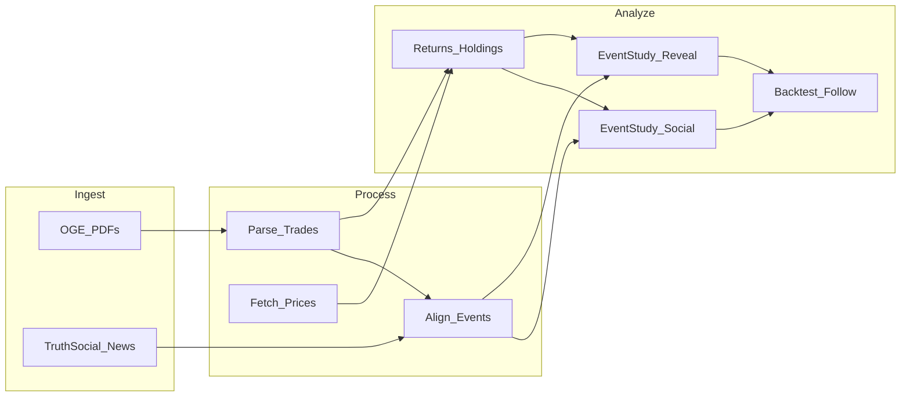

# Trump 股票交易与社交媒体 Alpha 研究

> **范围**：仅 **OGE Form 278-T 股票/ETF 交易**（2026 Q1，113 页 equity filing）。**不含债券。**

> **项目目标**：分析 entry、exit、持仓时间（reveal lag），结合 Truth Social / 新闻，检验 reveal alpha 与跟单策略。

**运行方式**：
- `python scripts/run_pipeline.py` — 一键分析
- `notebooks/01→03` — 分步验证
- 详见 [`README.md`](README.md)

**项目路径**：`/Users/haijiang/Desktop/Trump_following/`

---

## 一、研究问题（Hypotheses）

1. **披露滞后 alpha**：申报/reveal 公开后，相关标的是否存在可统计的短期 drift（event study）？
2. **社交信号 alpha**：Truth Social / 相关新闻发布前后，是否与交易方向、持仓变化有时间关联？
3. **持仓规律**：entry/exit 时机、持仓时长、行业/标的集中度与后续收益的关系。
4. **可跟进性**：在 public reveal 之后 N 天内跟单，扣除滑点/延迟后是否仍有正期望？

---

## 二、数据层设计

### 2.1 交易/披露数据（核心）

| 来源 | 用途 | 备注 |
|------|------|------|
| [OGE Form 278/278e](https://www.oge.gov/) | 总统/行政 branch 年度与离任披露 | 特朗普任期内主要来源；**非实时**，多为区间金额 |
| 新闻/媒体整理的 Periodic Transaction Report | 若存在对 Trump 信托/家族交易的结构化整理 | 需人工核实原始 PDF |
| [Senate eFD / House Clerk](https://efdsearch.senate.gov/) | 国会议员 PTR | **不适用于总统本人**，但可用于对比 methodology |
| [SEC EDGAR](https://www.sec.gov/edgar) | Form 4 / 13F | 适用于上市公司 insider，**非总统披露主渠道** |

**标准化字段**（`trades.parquet`）：

```
trade_id, person, ticker, asset_name, action(buy/sell/exchange),
amount_min, amount_max, transaction_date, disclosure_date,
source_doc, source_url, holding_period_days (computed)
```

**关键约束**：OGE 披露常为 **日期范围 + 金额区间**，不是精确股数；收益分析需用区间假设 + sensitivity（见 Notebook 04）。

### 2.2 价格数据

- **yfinance** 或 **Polygon/Alpha Vantage**（免费层起步）：日频 OHLCV、复权价。
- 映射 ticker ↔ 披露资产名（手工 alias 表 + fuzzy match，Notebook 02 验证）。

### 2.3 社交媒体 / 新闻

| 来源 | 用途 |
|------|------|
| Truth Social（scrape / 第三方 archive） | Trump 发帖时间与正文 |
| GDELT / NewsAPI / Google News RSS | 披露日、标的、Trump 相关 headline |
| 可选：X/Twitter archive（若可获取） | 补充 cross-post |

**标准化字段**（`events.parquet`）：

```
event_id, event_time, platform, text, url, tickers_mentioned, event_type(post/disclosure/news)
```

---

## 三、项目目录结构

```
Trump_following/
├── Trump_analysis.ipynb          # 总计划 + 索引（本文件）
├── requirements.txt
├── README.md
├── config/
│   └── settings.yaml
├── data/
│   ├── raw/
│   ├── processed/
│   └── manual/
├── notebooks/
│   01_fetch_disclosures.ipynb
│   02_parse_and_normalize_trades.ipynb
│   03_fetch_prices.ipynb
│   04_compute_returns_and_holdings.ipynb
│   05_fetch_social_and_news.ipynb
│   06_align_events_to_trades.ipynb
│   07_event_study_reveal_alpha.ipynb
│   08_event_study_social_alpha.ipynb
│   09_backtest_follow_strategy.ipynb
│   10_summary_and_patterns.ipynb
└── src/
    ├── disclosures.py
    ├── trades.py
    ├── prices.py
    ├── events.py
    └── backtest.py
```

---

## 四、Notebook 分步计划（每步可独立 rerun 验证）

### Step 0 — Trump_analysis.ipynb

- Markdown：本计划全文 + 假设 + 数据字典 + 验证 checklist
- 末尾：各 notebook 链接与当前进度表

| Step | Notebook | 状态 |
|------|----------|------|
| 0 | Trump_analysis.ipynb | 计划中 |
| 1 | 01_fetch_disclosures | 待开始 |
| 2 | 02_parse_and_normalize_trades | 待开始 |
| 3 | 03_fetch_prices | 待开始 |
| 4 | 04_compute_returns_and_holdings | 待开始 |
| 5 | 05_fetch_social_and_news | 待开始 |
| 6 | 06_align_events_to_trades | 待开始 |
| 7 | 07_event_study_reveal_alpha | 待开始 |
| 8 | 08_event_study_social_alpha | 待开始 |
| 9 | 09_backtest_follow_strategy | 待开始 |
| 10 | 10_summary_and_patterns | 待开始 |

---

### Step 1 — 01_fetch_disclosures.ipynb

**任务**：下载并 catalog 所有可用披露 PDF/HTML。

**实现要点**：
- 爬取 OGE 公开页面或使用已知 URL 列表（先手工收集 5–10 份验证 parser）
- 保存 `data/raw/disclosures/{doc_id}.pdf` + `manifest.csv`

**验证 checklist**：
- [ ] manifest 行数 ≥ 1
- [ ] 随机打开 3 个 PDF 与 manifest 一致
- [ ] 记录每份披露的 transaction date range vs filing/public date

---

### Step 2 — 02_parse_and_normalize_trades.ipynb

**任务**：从 PDF 提取交易记录，输出统一 `trades.parquet`。

**实现要点**：
- `pdfplumber` / `camelot` 表格提取；失败则 LLM-assisted 结构化（小批量）
- 解析 buy/sell、asset、ticker、amount bracket、date range
- 去重：`hash(person, ticker, action, date_range, amount)`

**验证 checklist**：
- [ ] 与 1–2 笔已知交易人工对照
- [ ] 缺失 ticker 比例 < 30%
- [ ] 输出 `data/manual/ticker_map.csv`

---

### Step 3 — 03_fetch_prices.ipynb

**任务**：为每笔 trade 拉取价格序列。

**实现要点**：
- 窗口：`[transaction_date - 30d, disclosure_date + 90d]`
- 缓存：`data/processed/prices/{ticker}.parquet`

**验证 checklist**：
- [ ] SPY 等与 Yahoo 网页一致
- [ ] 停牌/退市 ticker 有 flag

---

### Step 4 — 04_compute_returns_and_holdings.ipynb

**任务**：计算 entry/exit、持仓时间、多场景收益。

**指标**：
- `holding_days` = exit_date - entry_date
- `return_to_disclosure`：entry → disclosure_date
- `return_post_disclosure`：disclosure_date → +1d/+5d/+20d
- `return_whole_position`：entry → exit

**验证 checklist**：
- [ ] 单笔 trade 手算对照
- [ ] holding_days、return 分布图
- [ ] 按 buy/sell、行业分组汇总

---

### Step 5 — 05_fetch_social_and_news.ipynb

**任务**：拉取 Trump 帖子 + 相关新闻。

**验证 checklist**：
- [ ] 时间戳单调、无大量 duplicate
- [ ] 抽样 10 条与网页一致

---

### Step 6 — 06_align_events_to_trades.ipynb

**任务**：把 social/news/disclosure 事件与 trades 对齐。

**规则**：
- `disclosure_event`：disclosure_date 当天
- `social_near_trade`：transaction_date ±7d 内有 post
- `reveal_lag` = disclosure_date - transaction_date

**输出**：`data/processed/trade_event_links.parquet`

---

### Step 7 — 07_event_study_reveal_alpha.ipynb

**任务**：检验持仓被 reveal / 披露公开后的 abnormal return。

**方法**：事件日 = disclosure_date；估计窗口 [-120,-21]；事件窗口 [0,+1,+5,+20]；CAR + placebo

---

### Step 8 — 08_event_study_social_alpha.ipynb

**任务**：检验发 Truth Social / 新闻前后标的收益。

**子样本**：post 是否提及 ticker；发帖时市场是否已知持仓

---

### Step 9 — 09_backtest_follow_strategy.ipynb

**策略**：
1. Reveal follow：disclosure_date + 1 日开盘
2. Social follow：post 提及标的 → T+1 进场
3. 成本：commission + 5–20 bps slippage

---

### Step 10 — 10_summary_and_patterns.ipynb

汇总规律、alpha 结论、局限性与下一步（家族信托、DJT 等）。

---

## 五、依赖

```
jupyter, pandas, pyarrow, numpy, matplotlib, seaborn
yfinance, requests, beautifulsoup4, pdfplumber
python-dateutil, pytz, scipy, statsmodels, pyyaml
```

---

## 六、数据流



---

## 七、风险与局限性

- OGE 披露频率低、金额为区间 → 统计功效有限
- 总统披露 ≠ 议员 PTR，不能照搬 Capitol Trades API
- 相关 ≠ 因果；需 placebo 与分子样本
- 研究用途，非投资建议

---

## 八、Milestone

| 阶段 | 内容 | 目标 |
|------|------|------|
| M1 | Step 1–4 | ≥10 笔 trade 有 returns 表 |
| M2 | Step 5–6 | 事件对齐表 |
| M3 | Step 7–9 | 首版 alpha 数字 |

**下一步**：将本 Markdown 复制到 `Trump_analysis.ipynb` 首个 cell，然后执行 Step 1。
