# Trump 股票/ETF 交易分析报告

> 生成时间: 2026-06-02 09:44 · OGE Form 278-T · 第二任期上任以来

## 数据范围

- **分析区间**: 2025-01-21 → 2026-03-31（交易发生日）
- **278-T 文件数**: 6 份（有效 5）
- **披露日**: 2025-08-19, 2026-01-14, 2026-04-23, 2026-05-12
- **股票/ETF 可交易笔数**: **2,260**（**657** 只 ticker）
- **股票/ETF 名义下限合计**: **$144.5M**（OGE `amount_min` 求和）
- **全部解析行**: **3,900**（含债券等；全文件名义合计约 **$253.4M**）
- **表格解析率**: **92.7%**


**交易规模（Trump timing；名义 = OGE `amount_min`，金额优先于笔数）**

| 方向 | 笔数 | 名义下限合计 | 占总额比例 |
|------|-----:|-------------:|-----------:|
| 买入 | 1,774 | $105.4M | 70.8% |
| 卖出 | 513 | $43.5M | 29.2% |
| **合计** | **2,287** | **$148.9M** | 100% |


<figure class="report-fig">
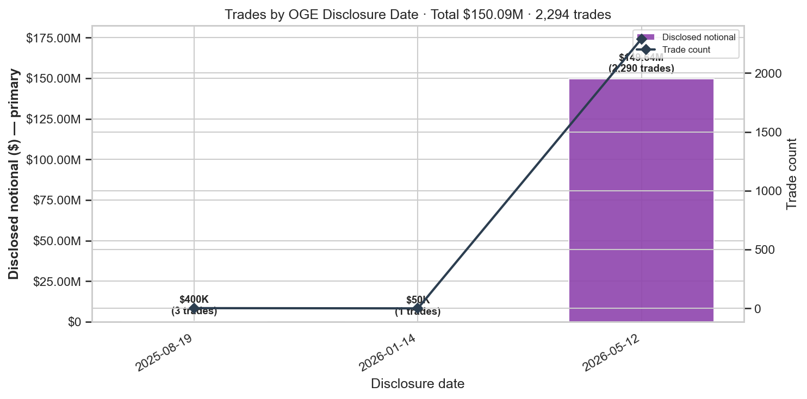
<figcaption>披露日批次：披露名义总额 + 笔数</figcaption>
</figure>


<figure class="report-fig">
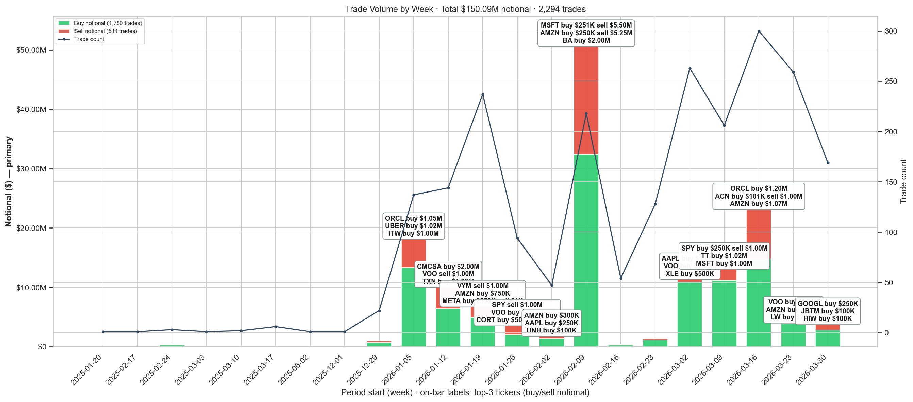
<figcaption>交易时间线（按日/周）：名义金额为主；柱顶标注 Top3 公司 buy/sell 名义</figcaption>
</figure>


<figure class="report-fig">
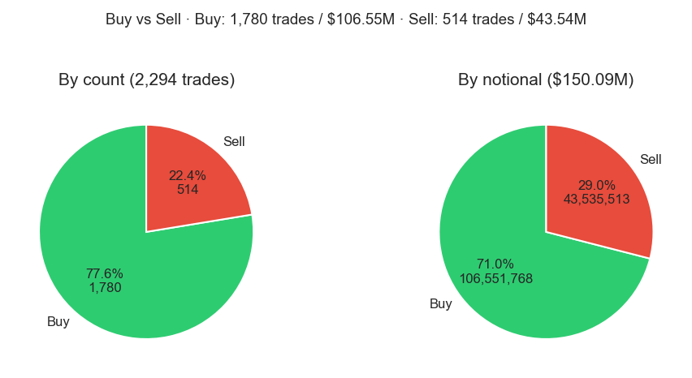
<figcaption>买入 vs 卖出：笔数与名义金额双饼图</figcaption>
</figure>


## Trump 当前净多头持仓（Top 10）

基于 **FIFO 未配对买入**（`match_status=open`），按净名义金额排序。
Horizon 收益以 **最早一笔未平买入** 的交易日为 anchor（Trump timing）。
截至分析截止日仍标注 **仍持有**；明细见 `reports/open_holdings_top10.csv`。

| Ticker | 净名义($) | 未平笔数 | 最早买入 | 最近买入 | 持有天 | 状态 | +1d | +5d | +10d | +20d | +30d |
|--------|----------:|---------:|----------|----------|------:|------|-----:|-----:|------:|------:|------:|
| AMZN | 2,396,015 | 15 | 2026-01-23 | 2026-03-27 | 127 | 仍持有 | -0.31% | 0.06% | -12.06% | -14.17% | -10.73% |
| AAPL | 2,200,008 | 8 | 2026-01-23 | 2026-03-25 | 127 | 仍持有 | 2.97% | 4.61% | 12.13% | 7.41% | 4.87% |
| MSFT | 2,062,013 | 13 | 2026-01-26 | 2026-03-31 | 124 | 仍持有 | 2.19% | -9.97% | -12.05% | -17.09% | -13.52% |
| CMCSA | 2,046,006 | 6 | 2026-01-12 | 2026-03-25 | 138 | 仍持有 | -2.00% | -1.96% | -0.08% | 12.49% | 7.20% |
| PTC | 2,018,006 | 6 | 2026-01-23 | 2026-03-02 | 127 | 仍持有 | 2.24% | -3.71% | -3.96% | -6.94% | 0.79% |
| COST | 1,862,012 | 12 | 2026-01-06 | 2026-03-25 | 144 | 仍持有 | -0.73% | 5.94% | 10.55% | 10.19% | 11.26% |
| MCHP | 1,530,005 | 5 | 2026-02-10 | 2026-03-17 | 109 | 仍持有 | 5.06% | 2.93% | -1.23% | -13.90% | -14.72% |
| VOO | 1,500,002 | 2 | 2026-03-02 | 2026-03-25 | 89 | 仍持有 | -0.88% | -1.18% | -2.55% | -7.69% | 1.44% |
| GOOGL | 1,445,009 | 9 | 2026-01-10 | 2026-03-31 | 140 | 仍持有 | 1.24% | -2.97% | 0.81% | -4.00% | -5.71% |
| AVGO | 1,381,008 | 8 | 2026-01-31 | 2026-03-31 | 119 | 仍持有 | -3.26% | 3.87% | 0.43% | -5.22% | -2.96% |


<figure class="report-fig">
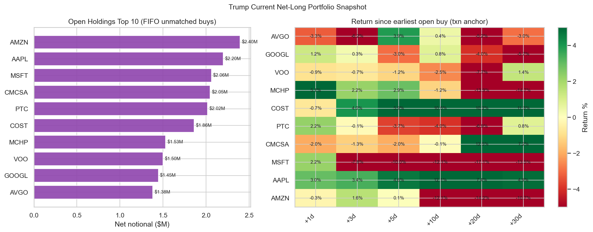
<figcaption>当前净多头 Top10：名义 + 买入后 horizon 收益</figcaption>
</figure>


## Trump 组合持仓与 PnL 时间序列

按 **FIFO 净多头** 重建每个交易日的 EOD 持仓：
- **持仓规模**：未平仓买入的 OGE `amount_min` 合计（成本）及按收盘价 mark-to-market 的市值；
- **每日 PnL**：各仍持有标的的日度价格变动 × 对应名义仓位，卖出日记入已实现收益；
- **累计 PnL**：全部交易日 daily PnL 的 running sum（整组合曲线）。

- 样本交易日: **337** 天
- 截止 **2026-05-29**：MTM 持仓 **$95.1M**，累计 PnL **$11.6M**
- 持仓 MTM 峰值: **$95.1M**（2026-05-29）

明细: `reports/portfolio_daily.csv`


<figure class="report-fig">
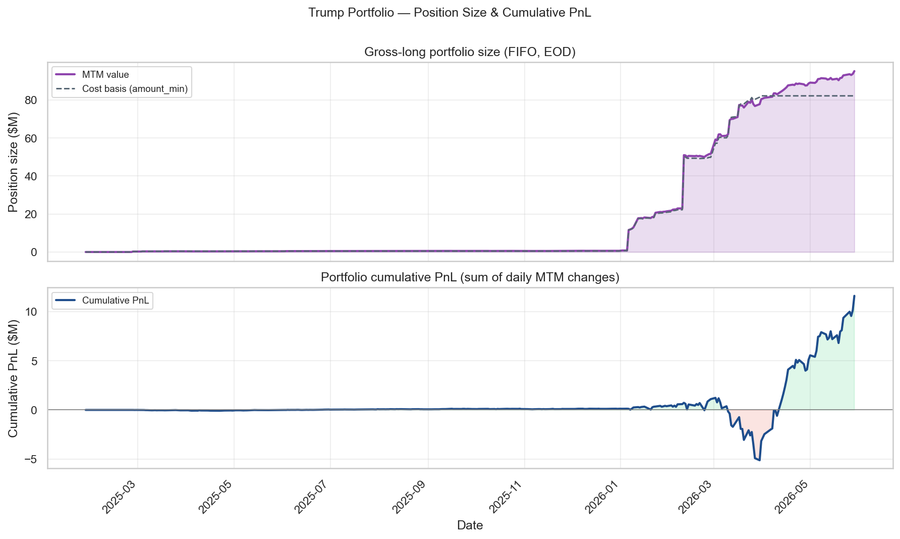
<figcaption>组合持仓规模与累计 PnL 随时间变化（FIFO 日度）</figcaption>
</figure>


<figure class="report-fig">
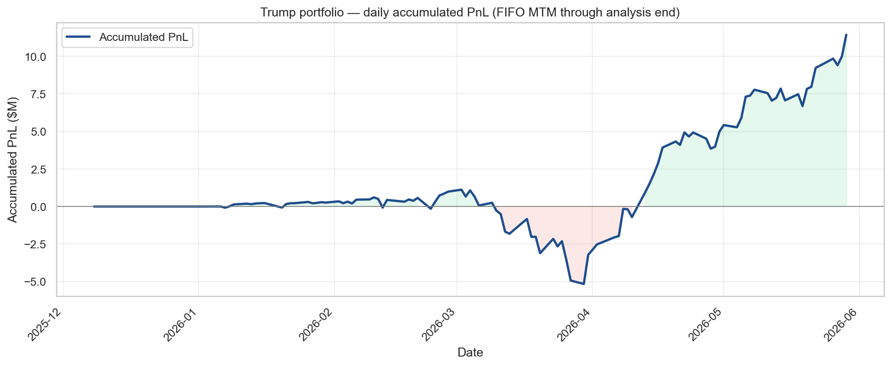
<figcaption>每个交易日累计 PnL（FIFO 盯市，直至分析截止日）</figcaption>
</figure>


<figure class="report-fig">
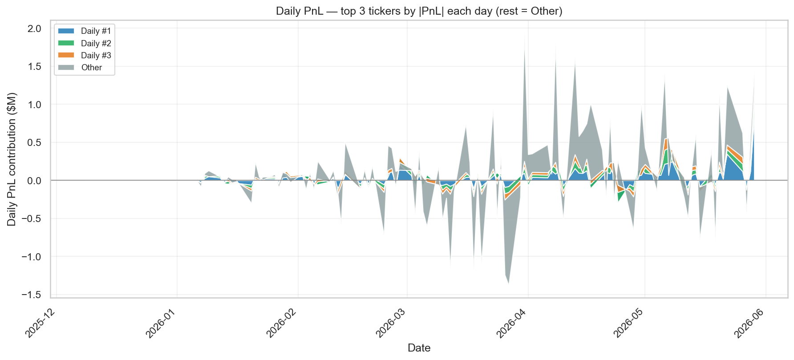
<figcaption>每日 PnL 贡献：当日 |PnL| 前三标的 + 其他</figcaption>
</figure>


## Cross-Check

- OGE 官方来源: ✅
- Form 278-T 检测: ✅

### 已纳入文件（逐份统计）

名义金额 = 各笔 OGE 区间**下限**（`amount_min`）相加；债券 filing 中「股票/ETF」多为 0 或 OCR 误映射。

| doc_id | 页数 | 披露日 | 解析笔数 | 股票/ETF笔数 | ticker数 | 股票名义($) | 全文件名义($) | 内容 |
|--------|-----:|--------|--------:|-------------:|---------:|------------:|--------------:|------|
| trump_278t_2025_08_19_a | 22 | 2025-08-19 | 108 | 3 | 2 | $400K | $21.2M | 以债券为主（含少量误解析） |
| trump_278t_2025_08_19_b | 7 | 2025-08-19 | 1 | 0 | 0 | — | $15K | 市政/公司债 |
| trump_278t_2025_11_17 | 3 | 2025-11-17 | 0 | 0 | 0 | — | — | 市政/公司债 |
| trump_278t_2026_01_14 | 8 | 2026-01-14 | 50 | 1 | 1 | $50K | $14.0M | 以债券为主（含少量误解析） |
| trump_278t_2026_04_23 | 8 | 2026-04-23 | 18 | 0 | 0 | — | $4.3M | 市政/公司债 |
| trump_278t_2026_05_08_bond | — | 2026-05-08 | — | — | — | — | — | 未下载 |
| trump_278t_2026_05_08_equity | 113 | 2026-05-12 | 3723 | 2256 | 640 | $144.0M | $213.8M | 股票/ETF 批量 |

## 样本验证

| Ticker | 动作 | 日期 | 匹配 |
|--------|------|------|------|
| DELL | purchase | 2026-02-10 | ✅ |
| NVDA | purchase | 2026-02-10 | ✅ |
| MSFT | sale | 2026-02-10 | ✅ |
| AMZN | sale | 2026-02-10 | ✅ |
| META | sale | 2026-03-18 | ✅ |

## Trump 本人发帖匹配

来源：**仅 Truth Social**（CNN 归档 + trumpstruth.org RSS + 手动 JSON）。
**不含** Google News 等第三方报道——只有 Trump **自己发的帖** 才能反映主动点名/炒作某公司的意图。
规则：以 **交易为中心**，对每笔交易在交易日 ±30 天、披露日 ±30 天内检索 Trump 帖文。
**Ticker 级链接**：帖文须 **明确提及 ticker**（`$T` 或公司全名）；未点名 ticker 的宏观帖不参与匹配。

- 载入 Trump 帖文（`events.parquet`）: **6729** 条
- 参与匹配的独立帖文: **13** 条（去重）
- 匹配链接总行数: **121**（含披露锚点 **2,307**）
- 至少 1 条 **Trump 发帖** 匹配的交易: **41** / 2314
- 至少 1 条 **ticker 级** 发帖匹配的交易: **41** / 2314

**按链接类型**

- `disclosure_event`: 2,307
- `ticker_mentioned`: 73
- `social_near_trade`: 33
- `social_near_disclosure`: 15

**按平台（独立事件数，非链接行数）**

- truth_social: 13

**样例帖文**

- [truth_social] Palantir Technologies (PLTR) has proven to have great war fighting capabilities and equipment. Just ask our enemies!!! P
- [truth_social] A front page Article in The Fake News Wall Street Journal states, without any verification, that I offered Jamie Dimon, 
- [truth_social] Trump sues JPMorgan Chase and CEO Jamie Dimon for $5B over alleged 'political' debanking: https://www.foxbusiness.com/po
- [truth_social] Numbers recently released show that TARIFFS have reduced the Trade Deficit of the United States by more than half. This 
- [truth_social] To show you how ridiculous the opinion is, the Court said that I'm not allowed to charge even $1 DOLLAR to any Country u
- [truth_social] A very happy and blessed Good Friday to all, especially to the 186,000 Americans who gained Private Sector jobs in the m

## Trump 发帖 × 收益 / 行为规律

以下仅用 **Trump 本人 Truth Social 帖文中明确出现 ticker** 的 strict 匹配（宏观帖、英文 homograph 如 A/S/HE 已过滤）。
Trump PnL = 该笔 **买入** 交易 timing +10 交易日名义 PnL；已实现 PnL = FIFO 配对 lot 的 entry→exit 收益。
Top 表按 `(ticker, event)` 去重；**sale** 行的 PnL 来自该笔卖出交易自身 timing，非买入。

### 是否存在「先买 → 发帖 → 卖」？

- FIFO 配对中 **3** 对持仓期间有 **ticker 级别 Trump 发帖** 提及
- 其中 **2** 对：**买入 → 持仓期内 Trump 发帖 → 卖出**
- **0** 对：Trump 发帖在买入前 30 天内
- 持仓期内发帖相对买入日中位 lag: **3.0** 天
- 上述「买→发帖→卖」样例：买入 +10d 平均收益 **-1.73%**（PnL **$-1,843**）；已实现平均 **-5.69%**（PnL **$-507**）

**解读**：在 **帖文必须出现 ticker** 的严格筛选下：
- **2** 对 FIFO 持仓满足「买→持仓期内 Trump 点名 ticker→卖」，中位发帖 lag **约 3.0 天**；
- 第三方新闻报道（Google News 等）**已排除**，不参与本分析；
- 未见稳定的「secret 建仓 → Truth 点名该 ticker → 数日内卖出」链条；
- Truth **宏观帖**（通胀、美元等）若未点名 ticker，已从本分析剔除。

### Top 交易×Trump 发帖（按交易名义金额排序）

| Ticker | 动作 | 交易日 | 名义($) | 发帖日 | Δ天 | +10d PnL | 平台 | 帖文 |
|--------|------|--------|--------:|--------|----:|---------:|------|------|
| PLTR | sale | 2026-02-10 | 1,000,001 | 2026-04-10 | 59 | 38,133 | truth_social | Palantir Technologies (PLTR) has proven to have great war fighting cap |
| JPM | sale | 2026-01-02 | 50,001 | 2026-01-17 | 15 | 1,782 | truth_social | A front page Article in The Fake News Wall Street Journal states, with |
| JPM | sale | 2026-01-12 | 50,001 | 2026-01-22 | 10 | 3,726 | truth_social | Trump sues JPMorgan Chase and CEO Jamie Dimon for $5B over alleged 'po |
| TTD | purchase | 2026-02-10 | 50,001 | 2026-04-04 | 53 | -5,279 | truth_social | Not only were the jobs numbers GREAT yesterday, 178,000 new jobs, but  |
| TTD | purchase | 2026-02-10 | 50,001 | 2026-02-20 | 10 | -5,279 | truth_social | To show you how ridiculous the opinion is, the Court said that I'm not |
| TTD | purchase | 2026-02-10 | 50,001 | 2026-04-03 | 52 | -5,279 | truth_social | A very happy and blessed Good Friday to all, especially to the 186,000 |
| GS | purchase | 2026-03-02 | 15,001 | 2026-05-12 | 71 | -1,165 | truth_social | CNBC incorrectly reported that the Great Jensen Huang, of Nvidia, was  |
| GS | purchase | 2026-03-02 | 15,001 | 2026-05-12 | 71 | -1,165 | truth_social | RT @realDonaldTrumpCNBC incorrectly reported that the Great Jensen Hua |
| GS | purchase | 2026-03-02 | 15,001 | 2026-05-13 | 72 | -1,165 | truth_social | RT @realDonaldTrumpCNBC incorrectly reported that the Great Jensen Hua |
| LMT | purchase | 2026-03-12 | 15,001 | 2026-03-06 | -6 | -586 | truth_social | We just concluded a very good meeting with the largest U.S. Defense Ma |
| TMO | purchase | 2026-03-21 | 15,001 | 2026-03-11 | -10 | 357 | truth_social | I am on my way to the Great State of Ohio, which I love and WON BIG th |
| NOC | purchase | 2025-03-17 | 1,001 | 2026-03-06 | 354 | 44 | truth_social | We just concluded a very good meeting with the largest U.S. Defense Ma |

完整列表: `reports/media_top_trade_event_pairs.csv`

### Top3 匹配 ticker 时间线（买 → 发帖 → 卖 / 仍持有）

下图展示 **匹配名义金额最大的 3 只 ticker**：绿色▼=买入、蓝色◆=Trump Truth 发帖、红色▲=卖出；灰条=持仓区间，右端标注是否仍持有。


<figure class="report-fig">
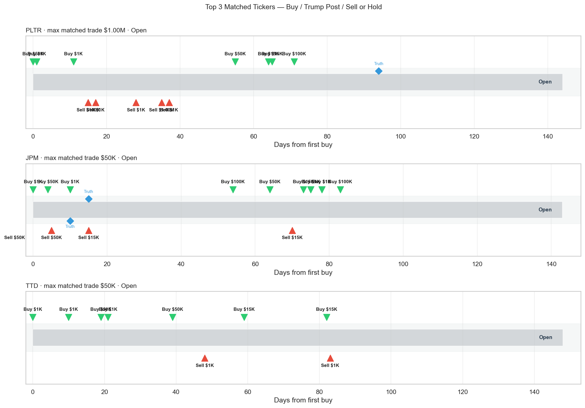
<figcaption>Top3 匹配 ticker：买入 / Trump 发帖 / 卖出或仍持有</figcaption>
</figure>

### Trump 发帖匹配的 Top Ticker（按 Trump 名义金额排序）

| Ticker | Trump名义($) | 独立事件 | 交易笔数 | 买/卖链接 | Trump NW +10d |
|--------|------------:|---------:|---------:|----------:|--------------:|
| PLTR | 1,335,012 | 1 | 12 | 7/5 | 3.60% |
| JPM | 451,015 | 2 | 6 | 6/6 | 0.86% |
| TTD | 135,009 | 4 | 7 | 19/2 | -12.05% |
| GS | 61,005 | 3 | 5 | 15/0 | 0.65% |
| TMO | 45,003 | 1 | 3 | 3/0 | -2.00% |
| LMT | 31,003 | 1 | 3 | 3/0 | -4.08% |
| NOC | 1,001 | 1 | 1 | 1/0 | 4.39% |

### 「买→发帖→卖」样例（ticker 必须在帖中出现）

| Ticker | 买 | 卖 | 持仓d | 发帖日 | 发帖-买(d) | 买+10d收益 | 买+10d PnL | 已实现收益 | 已实现 PnL | 样例 |
|--------|----|----|------:|--------|----------:|-----------:|----------:|-----------:|-----------:|------|
| JPM | 2026-01-17 | 2026-03-18 | 60 | 2026-01-17 | 0 | 4.00% | $40 | -4.95% | $-50 | A front page Article in The Fake News Wall Street  |
| JPM | 2026-01-11 | 2026-01-22 | 11 | 2026-01-17 | 6 | -7.45% | $-3,726 | -6.43% | $-964 | A front page Article in The Fake News Wall Street  |

明细: `reports/media_buy_post_sell_patterns.csv`


## 持仓时间（FIFO 买→卖配对）

- 成功配对: **291** 对，涉及 **202** 个 ticker
- 持仓中位: **31** 天，均值: **37** 天
- 规则: 同 ticker 按日期排序，**先进先出**；无对应买入的卖出标为 `prior_position`；未卖出买入标为 `open`
- 明细: `reports/matched_lots.csv`（每笔买-卖对），`reports/holdings_by_ticker.csv`（每 ticker 平均持仓）

### Top tickers（按 Trump 名义金额）

```
ticker  n_matched_pairs  n_open_buys  n_prior_sells  avg_holding_days  median_holding_days  min_holding_days  max_holding_days  trump_total_notional
  AMZN                4           15              0             31.00                 32.5              24.0              35.0             8848023.0
  MSFT                4           13              0             92.50                 20.5               6.0             323.0             8443021.0
   VOO                1            2              2             47.00                 47.0              47.0              47.0             5500006.0
  NVDA                4            7              0             28.75                 31.0              11.0              42.0             3617015.0
   SPY                1            1              2             11.00                 11.0              11.0              11.0             3500005.0
    BA                2            4              0             39.50                 39.5              35.0              44.0             2533008.0
  ORCL                2           14              0             25.00                 25.0              15.0              35.0             2530018.0
  UBER                2           12              0             36.50                 36.5              36.0              37.0             2289015.0
  META                4           13              0            102.00                 38.0               9.0             323.0             2202021.0
   ACN                4            4              0             30.00                 31.5              22.0              35.0             2184012.0
```


<figure class="report-fig">
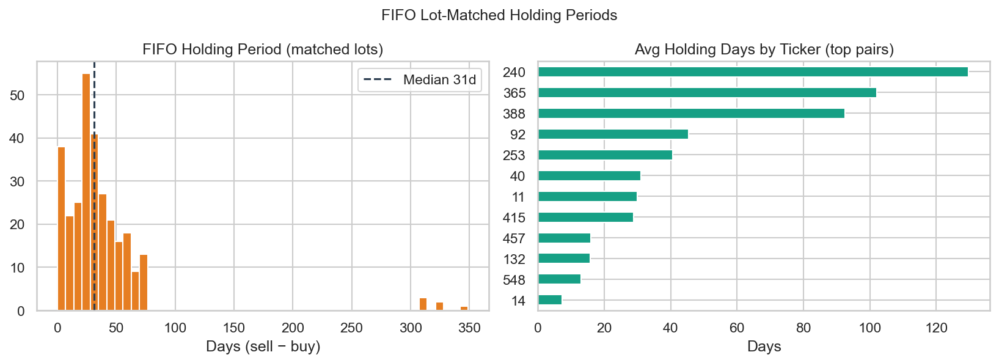
<figcaption>FIFO 持仓天数分布</figcaption>
</figure>


## 1. Trump 自身交易 timing（锚点 = **交易发生日**）

- **事件研究**：每笔交易当日为锚点，看 +h 交易日价格；买入 sign=+1，卖出 sign=−1
- **已实现（realized）**：FIFO 配对 **entry=买入日收盘**、**exit=卖出日收盘**（见 §1d）
- notional = OGE `amount_min`；窗口: **1, 3, 5, 10, 20, 30** 个交易日

### 1a. 合计（买 + 卖）

| 窗口(交易日) | 笔数 | 总名义($) | 总PnL($) | **名义加权收益率** |
|---|---:|---:|---:|---:|
| +1d | 2288 | 148,906,275 | -222,803 | **-0.15%** |
| +3d | 2288 | 148,906,275 | 238,569 | **0.16%** |
| +5d | 2288 | 148,906,275 | 1,785 | **0.00%** |
| +10d | 2288 | 148,906,275 | -219,695 | **-0.15%** |
| +20d | 2288 | 148,906,275 | -124,233 | **-0.08%** |
| +30d | 2288 | 148,906,275 | 1,901,053 | **1.28%** |


<figure class="report-fig">
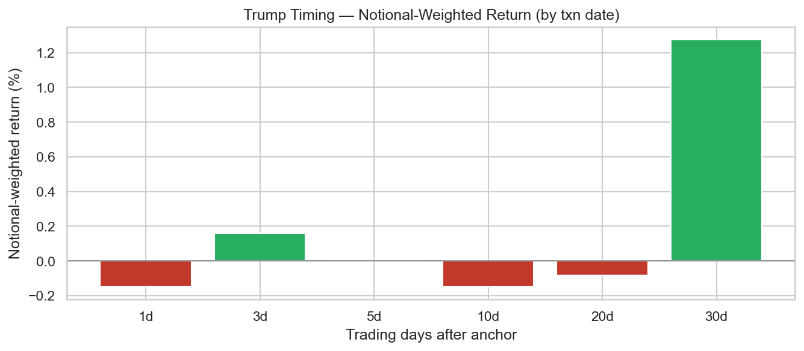
<figcaption>Trump timing：名义加权 horizon 收益</figcaption>
</figure>

### 1b. Trump 买（仅 `purchase`）

| 窗口(交易日) | 笔数 | 总名义($) | 总PnL($) | **名义加权收益率** |
|---|---:|---:|---:|---:|
| +1d | 1774 | 105,356,763 | -582,065 | **-0.55%** |
| +3d | 1774 | 105,356,763 | -409,758 | **-0.39%** |
| +5d | 1774 | 105,356,763 | -501,241 | **-0.48%** |
| +10d | 1774 | 105,356,763 | -346,415 | **-0.33%** |
| +20d | 1774 | 105,356,763 | 535,786 | **0.51%** |
| +30d | 1774 | 105,356,763 | 1,745,498 | **1.66%** |

### 1c. Trump 卖（仅 `sale`，按做空计 sign=−1）

| 窗口(交易日) | 笔数 | 总名义($) | 总PnL($) | **名义加权收益率** |
|---|---:|---:|---:|---:|
| +1d | 513 | 43,534,511 | 359,414 | **0.83%** |
| +3d | 513 | 43,534,511 | 648,753 | **1.49%** |
| +5d | 513 | 43,534,511 | 503,088 | **1.16%** |
| +10d | 513 | 43,534,511 | 126,750 | **0.29%** |
| +20d | 513 | 43,534,511 | -659,496 | **-1.51%** |
| +30d | 513 | 43,534,511 | 155,647 | **0.36%** |


<figure class="report-fig">
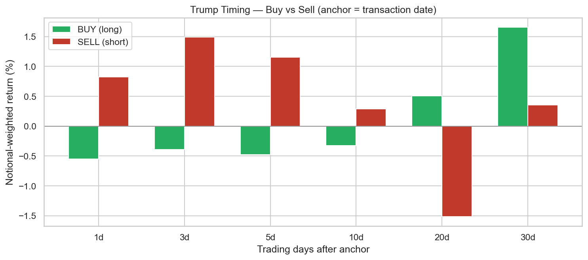
<figcaption>Trump timing：买入 vs 卖出 NW 收益对比</figcaption>
</figure>


<figure class="report-fig">
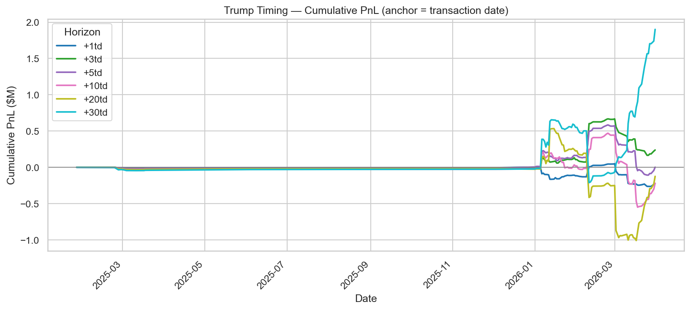
<figcaption>Trump timing：累计 PnL（按交易日）</figcaption>
</figure>

### 1d. 已实现收益（FIFO entry → exit）

假设：**entry** = 买入日收盘价，**exit** = 卖出日收盘价；名义 = min(买/卖 `amount_min`)。
未平仓买入按 **mark-to-market** 至 2026-05-30（未实现）。

| 类型 | 配对/笔数 | 名义($) | 总 PnL($) | **NW 收益率** | 中位持仓(天) | 胜率 |
|------|----------:|--------:|----------:|--------------:|-------------:|-----:|
| 已实现（买→卖） | 290 | 8,531,290 | -730,951 | **-8.57%** | 31 | 15.2% |

- 无对应买入的卖出（`prior_position`）: **227** 笔 — 未计入 realized

明细: `reports/realized_fifo_lots.csv`

## 2. Follow Trump（锚点 = **OGE 披露日**）

- 披露日跟单，方向与 Trump 一致：**买入 = 做多**，**卖出 = 做空**
- 下面先给 **合计**，再拆 **Follow 买** / **Follow 卖**

### 2a. 合计（买 + 卖）

| 窗口(交易日) | 笔数 | 总名义($) | 总PnL($) | **名义加权收益率** |
|---|---:|---:|---:|---:|
| +1d | 2288 | 148,906,275 | 89,330 | **0.06%** |
| +3d | 2288 | 148,906,275 | -228,627 | **-0.15%** |
| +5d | 2288 | 148,906,275 | -451,342 | **-0.30%** |
| +10d | 2288 | 148,906,275 | 1,010,177 | **0.68%** |
| +20d | 4 | 450,004 | 15,554 | **3.46%** |
| +30d | 4 | 450,004 | 1,380 | **0.31%** |


<figure class="report-fig">
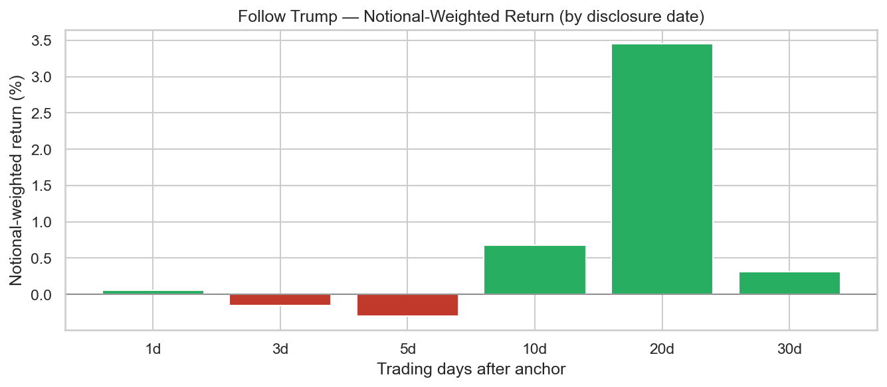
<figcaption>Follow 披露日：名义加权 horizon 收益</figcaption>
</figure>

### 2b. Follow 买（仅 `purchase`，做多）

| 窗口(交易日) | 笔数 | 总名义($) | 总PnL($) | **名义加权收益率** |
|---|---:|---:|---:|---:|
| +1d | 1774 | 105,356,763 | -96,512 | **-0.09%** |
| +3d | 1774 | 105,356,763 | -175,491 | **-0.17%** |
| +5d | 1774 | 105,356,763 | -401,577 | **-0.38%** |
| +10d | 1774 | 105,356,763 | 1,966,202 | **1.87%** |
| +20d | 4 | 450,004 | 15,554 | **3.46%** |
| +30d | 4 | 450,004 | 1,380 | **0.31%** |

### 2c. Follow 卖（仅 `sale`，做空）

| 窗口(交易日) | 笔数 | 总名义($) | 总PnL($) | **名义加权收益率** |
|---|---:|---:|---:|---:|
| +1d | 513 | 43,534,511 | 185,744 | **0.43%** |
| +3d | 513 | 43,534,511 | -53,275 | **-0.12%** |
| +5d | 513 | 43,534,511 | -49,929 | **-0.11%** |
| +10d | 513 | 43,534,511 | -956,611 | **-2.20%** |
| +20d | 0 | 0 | 0 | — |
| +30d | 0 | 0 | 0 | — |


<figure class="report-fig">
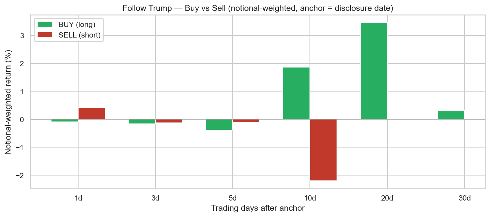
<figcaption>Follow：买入 vs 卖出 NW 收益对比</figcaption>
</figure>


<figure class="report-fig">
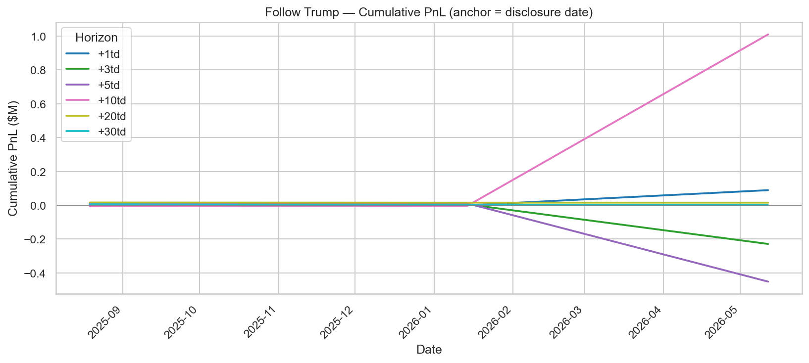
<figcaption>Follow 披露日：累计 PnL</figcaption>
</figure>

## 附录：旧版等权披露日回测（参考）

- Reveal lag 中位: **71** 天
- 等权按披露日复利 (+1td only): **2.25%**
- 胜率 (+1td): **43.3%**


<figure class="report-fig">
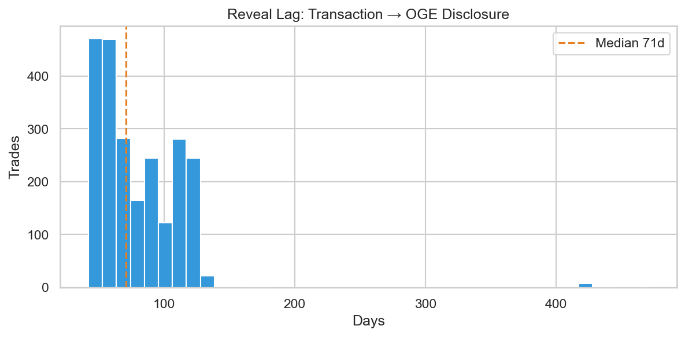
<figcaption>披露滞后（交易日 → 披露日）</figcaption>
</figure>


<figure class="report-fig">
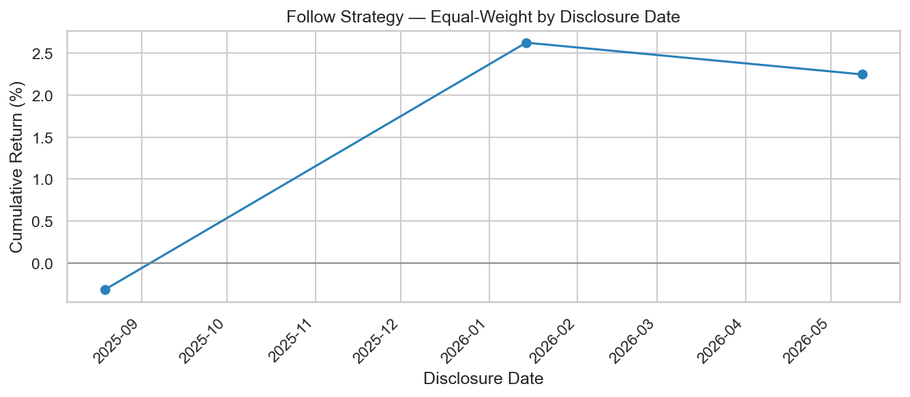
<figcaption>Legacy：等权披露日回测累计收益</figcaption>
</figure>


<figure class="report-fig">
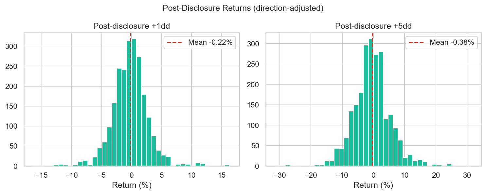
<figcaption>Legacy：披露后收益分布</figcaption>
</figure>


<figure class="report-fig">
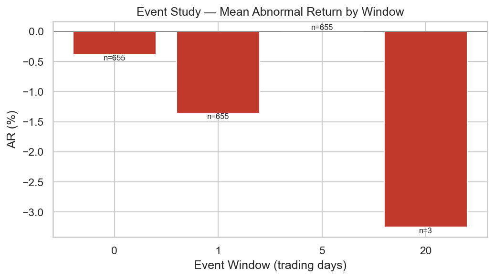
<figcaption>事件研究：披露日 abnormal return</figcaption>
</figure>

## Top Tickers（按 Trump 名义金额 `amount_min` 合计）

```
ticker  trades  buys  sales  total_notional  avg_post_5d  avg_post_1d
  AMZN      23    19      4       8848023.0    -0.015898     0.010574
  MSFT      21    17      4       8443021.0     0.014650    -0.003886
   VOO       6     3      3       5500006.0     0.000000     0.000000
  NVDA      15    11      4       3617015.0    -0.000359     0.010674
   SPY       5     2      3       3500005.0     0.001206    -0.001119
    BA       8     6      2       2533008.0    -0.046143     0.007874
  ORCL      18    16      2       2530018.0    -0.022355     0.012198
  UBER      16    14      2       2289015.0    -0.022296    -0.016304
  META      21    17      4       2202021.0    -0.000204     0.012678
  AAPL       8     8      0       2200008.0     0.014145     0.013806
   ACN      12     8      4       2184012.0     0.013803    -0.019890
  NFLX      12    10      2       2167012.0     0.012701    -0.000761
 CMCSA       6     6      0       2046006.0    -0.004016     0.001606
   PTC       8     7      1       2034008.0     0.005044    -0.017733
  COST      12    12      0       1862012.0     0.070889     0.010960
```


<figure class="report-fig">
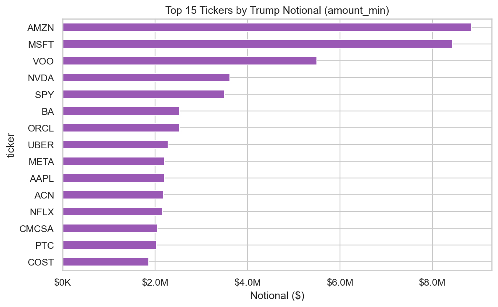
<figcaption>Trump 名义金额 Top Ticker（amount_min 合计）</figcaption>
</figure>


## 说明

- 上任以来 **6 份** 278-T 中，**股票/ETF 批量披露**集中在 `trump_278t_2026_05_08_equity`（2026-05-12 收到）；其余多为市政/公司债 periodic report。
- 名义金额 = OGE 披露区间**下限**相加，非精确成交价；单笔可能落在 $1,001–$15,000 至 $50M+ 等 bracket。
- `return_post_disclosure_20d` 在披露日距数据截止不足 20 交易日时为空。

完整数据: `reports/trades_analysis.csv`
